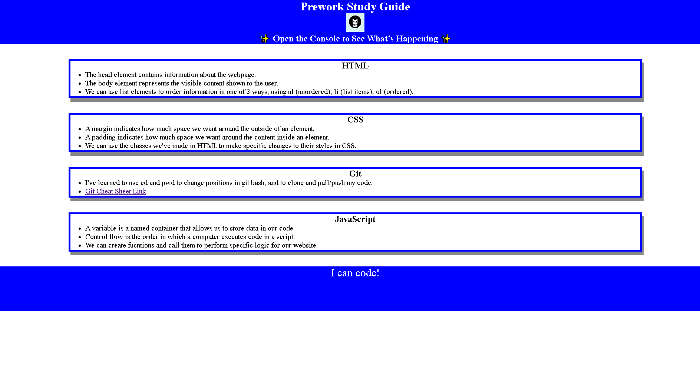

# Prework Study Guide Webpage

## Description

The motivation behind this project was to create a website housing all the notes a student could need for the individual topics we covered in our prework. 
This includes notes for HTML, CSS, JavaScript, and Git. This solves the issue of not having a good place for all of our notes, while also giving me good practice for skills I will need.

## Installation

N/A

## Usage

To use my Prework Study Guide, you can simply review every topic by reading every list. You can choose a topic by using google inspect to open the console which will return 
a random topic to study.

## Credits

N/A

## License

Please refer to the LICENSE in the repo.
